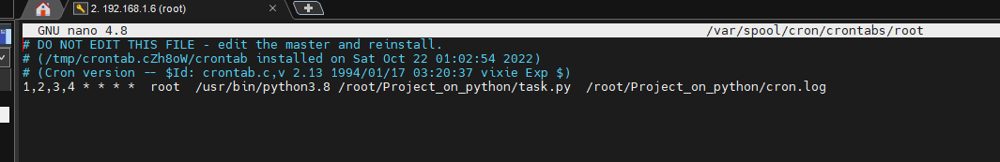
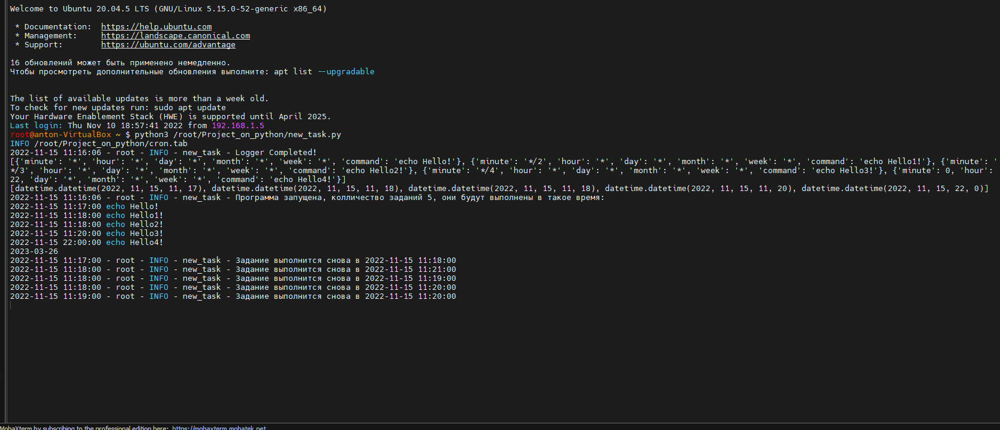

*`Cron` — это обычное название демона GNU/Linux, который периодически запускает сценарии в соответствии с установленным вами расписанием. Вы добавляете свой скрипт в crontab или помещаете символическую ссылку на него в специальный каталог, а демон выполняет работу по его запуску в фоновом режиме.* 

*Задания `Cron` записываются и управляются в специальном файле, известном как `crontab`. У каждого профиля пользователя в системе может быть свой собственный crontab, где они могут планировать задания, которые хранятся в /var/spool/cron/crontabs/.*

___

+ *Создать скрипт на `Python`*


+ *Проверить не создан ли `crontab` уже, если создан - удалить*

```sh
$ crontab -l 
$ crontab -r
```

+ *Создать файл и добавить в выполнение от юзера*

```sh
$ touch task.cron
$ crontab task.cron
$ nano task.cron
```


+ *Привязать выполнения скрипта*

```sh
1,2,3,4 * * * *  root  /usr/bin/python3.8 /root/Project_on_python/task.py
```




+ *Редактировать существующий `crontab` пользовательский*

```sh
$ crontab -e
```

___
*Задача заключалась в том чтобы написать python программу которая будет считывать конфиг файл `config.ini` инициализировать логги, устанавливать формат времени и писать их в файл `events.log`, после этого с помощью библиотеки `crontab` и `cronvalidator` делать валидацию выражения и парсинг с файла `crontab` (можно было использовать regexp) формировать список, а потом обьединять ключи с результатом и добавлять это все в дикшионари. После этого выражения со временем из кронтаба нужно перевести в человекочитаемое время и отталкиваясь от системного времени, выаодить время следующей сработки команды с помощью библиотеки `croniter`. После этого у нас цикл с форком сравнивает время выполнения команды с `timelist`.Другими словами, итерируем `tasklist` сравниваем с текущей датой и временем и форкаем процесс если прищло время исполнять. Так же в конце цикла прописано когда будет проверятся в системе время c переводом на летнее и зимнее, которое я нашел в функции `is_date_of_DSTtransition` , и если время настоящее будет попадать под обозначенное, то прогонять еще раз команды из `result`. В `main` есть еще одна часть парсинга из кронтаба и будет показывать когда задание выполниться*

```python
from crontab import CronTab, CronSlices
import re
from cron_validator import CronValidator
import time as tim
import logging
import os
import configparser, sys
from cron_converter import Cron
from datetime import datetime, time, timedelta
from croniter import croniter
from signal import SIGTERM
from backports.zoneinfo import ZoneInfo


def configure_parsing_and_init():
    config = configparser.RawConfigParser()
    configFilePath = '/root/Project_on_python/config.ini'
    if(not os.path.exists(configFilePath)):
        print('Configuration file not found in directory')
        sys.exit(1)
    config.read(configFilePath)

    try:
        Logging_level = config.get('LOGGER', 'LEVEL')
        Format_time = config.get('CRONFILE', 'PATH')
        
       
    except Exception as e :
        print(str(e),' Сould not read configuration file')
        sys.exit(1)
    print (Logging_level, Format_time)
    return config

def configure_logging(config):
    dir_path = os.path.dirname(os.path.realpath(__file__))
    filename = os.path.join('/root/Project_on_python/', 'events.log')

    logFormatter = logging.Formatter('%(asctime)s - %(name)s - %(levelname)s - %(module)s - %(message)s', datefmt='%Y-%m-%d %H:%M:%S')
    Logger = logging.getLogger()
    Logger.setLevel(config['LOGGER']['LEVEL'])

    fileHandler = logging.FileHandler(filename.format(tim.strftime('%Y%m%d%H%M%S')))
    fileHandler.setFormatter(logFormatter)
    Logger.addHandler(fileHandler)

    consoleHandler = logging.StreamHandler()
    consoleHandler.setFormatter(logFormatter)
    Logger.addHandler(consoleHandler)

    Logger.info("Logger Completed!")

    return Logger


def input_validate(config):
    cronlist = CronTab(tabfile=config['CRONFILE']['PATH'], user=False)
    listJobs = []
    for job in cronlist:
        listJobs.append(str(job))
        for jobs in job:  
            assert CronValidator.parse('* * * * *') is not None
            assert CronValidator.parse('*/2 * * * *') is not None
            assert CronValidator.parse('*/3 * * * *') is not None
            assert CronValidator.parse('*/4 * * * *') is not None
            assert CronValidator.parse('0 22 * * *') is not None
    
    return listJobs


def input_info(listJobs):
    keys = ['minute', 'hour' , 'day', 'month', 'week', 'command']
    result = []
    for line in listJobs:
        tmp = [int(w) if w.isdigit() else w for w in line.rstrip().split(' ', 5) ]
        result.append(dict(zip(keys, tmp)))
            
    return result

def setting_humanreadeble_time(result):
    try:
        index=0
        tasktime = []
        while index<len(result):

            tasktime.append(croniter(f"{result[index]['minute']} {result[index]['hour']} {result[index]['day']} \
                {result[index]['month']} {result[index]['week']}", datetime.now()).get_next(datetime))
            index+=1
            
    except Exception as ex:
        print(str(ex),'Invalid CRON expression: %s')

    return tasktime


def workflow(timelist, result, logger, transitiontime):
    index=0
    while True:
        if (index<len(result)):
            if (datetime.now().replace(microsecond=0)==timelist[index]):
                pr=os.fork()
                if pr==0:
                    os.system(result[index]['command'])
                    logger.info(f"Идентификатор процесса: {pr}. Команда {result[index]['command']} выполнена!")
                    break
                else:
                    timelist[index] = croniter(f"{result[index]['minute']} {result[index]['hour']} {result[index]['day']} {result[index]['month']} {result[index]['week']}", datetime.now()).get_next(datetime)
                    logger.info(f"Задание выполнится снова в {timelist[index]}")
                    index+=1
                    os.kill(pr, SIGTERM)
                    continue
            else:
                index+=1
                continue
        else:
            index=0
        if datetime.now().date()==transitiontime and datetime.now().hour==2 and datetime.now().minute==59 or \
            datetime.now().date()==transitiontime and datetime.now().hour==3 and datetime.now().minute==59:
            time.sleep(60)
            transitiontime = is_date_of_DSTtransition()
            for i in range(0, len(result)):
                timelist[index] = croniter(f"{result[index]['minute']} {result[index]['hour']} {result[index]['day']} \
                    {result[index]['month']} {result[index]['week']}", datetime.now()).get_next(datetime)       
                print (f"Время переведенно, в следующий раз время будет переводится {transitiontime}")


def is_date_of_DSTtransition(dt: datetime, zone: str) -> bool:
    """
    check if the date part of a datetime object falls on the date
    of a DST transition.
    """
    _d = datetime.combine(dt.date(), time.min).replace(tzinfo=ZoneInfo(zone))
    return _d.dst() != (_d+timedelta(1)).dst()


def result_of_transition_time():

    for d in range(366):
        if is_date_of_DSTtransition(datetime.now() + timedelta(d), "Europe/Kiev"):
        
            transitiontime = ((datetime.now() + timedelta(d)).date())
            print(transitiontime)
            return transitiontime


now = datetime.now()

def main():
    
    config = configure_parsing_and_init()
    
    logger = configure_logging(config)
    
    

    listJobs = input_validate(config)
    print (input_info(listJobs))


    result = input_info(listJobs)
    print (setting_humanreadeble_time(result))

    timelist = setting_humanreadeble_time(result)

    logger.info(f"Программа запущена, колличество заданий {len(result)}, они будут выполнены в такое время:")
    f = open("/root/Project_on_python/cron.tab","r")
    f1 = f.readlines()
    for x in f1:
        if not re.match('^[0-9*]', x):
            continue
        a = re.split(r'\s+', x)
        cron = croniter(' '.join(a[:5]), now)
        print("%s %s" % (cron.get_next(datetime), ' '.join(a[5:])))

    transitiontime = result_of_transition_time()
    workflow(timelist, result, logger, transitiontime)
                         
    

if __name__ == '__main__':
    main()
```

___

#### *Вывод*


