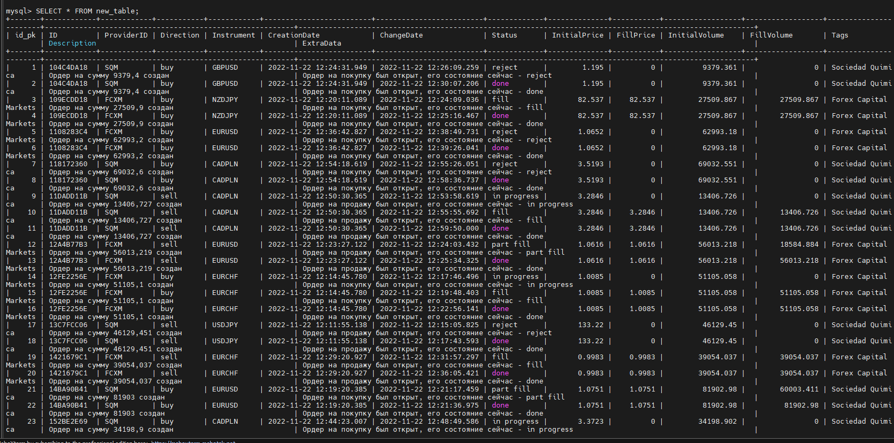

## *Generate 2500 thousand historical records in excel using functions and load the insert query into the database*

___
*Предварительно нужно было сгенерировать 2500 записей ордеров в *Excel* только с помощью стандартных функций, основное условие было что каждое значение должно быть псевдослучайным, для этого был применен тригонометрический метод, а так же были временные рамки для количества ордеров котрые должны находиться в отметках по времени с `12:00-13:00`; `13:00-11:00`; `11:00-12:00` все записи ордеров должны выполниться за 24 часа учитывая перерыв биржи с `23:00-00:00` в который ордера не могут не создаватся и не быть выполнены, иметь время обработки одной записи ордера до 5 минут. А так же все записи ордеров должны быть последовательны в выполнении: `In progress-fill/reject/part fill-done` для первой зоны; `New-In progress-fill/reject/part fill-done` для второй; `New-In progress-fill/reject/part fill` - для третьей; и иметь свою логику заполнения и выставления цены и обьемов. Генерация времени спользовалась через `Timestamp`, поиск и вывод по колонкам `ВПР,ПОИСКПОЗ+ИНДЕКС,ПРОСМОТР, ВЫБОР`*
___

### *Installing nessesary software*

*У меня ОС Linux Debian 11, в которую я собираюсь устновить `MySQL-8` и подключатся к ней с моего хоста с виндой. Тип сети VirtualBox - `NAT`*

+ *Обновить системные пакеты до последней версии*

```sh
$ sudo apt update
$ sudo apt upgrade
```

+ *Установить утилиту `wget`*

```sh
$ apt install wget
```

+ *Загрузите пакет `mySQL` последней версии с помощью следующей команды*

```sh
$ wget https://dev.mysql.com/get/mysql-apt-config_0.8.22-1_all.deb
```

+ *Установить пакет `mySQL`. В выпадающем меню выбрать -ОК*

```sh
$ wget https://dev.mysql.com/get/mysql-apt-config_0.8.22-1_all.deb
$ sudo apt update
$ sudo apt install mysql-server
```  

+ *Проверить статус базы данных*

```sh
$ sudo service mysql status
``` 

+ *Можно в нее зайти локально*
  
```sh
$ sudo mysql -u root -p
``` 


+ *Установить `MySQL Workbench` на `Windows`. С его помощью можно создавать и редактировать таблицы и другие объекты, управлять доступом пользователей и полноценно администрировать БД. По ссылке https://dev.mysql.com/downloads/workbench/*


+ *Для удаленного доступа откроем порт 3306 на виртуальной машине Debian*

```sh
$ sudo ufw allow 3306
$ sudo ufw enable
$ sudo ufw status verbose
``` 


+ *Настроить проброс портов для `ssh` и `mysql` на VirtualBox для того чтобы мы смогли подключиться к базе при режиме сети NAT*


+ *Настройка сеанса выглядит так:*


*У меня получилось установить сеанс. Хотя Экземпляр `MySQL` настроен только на прослушивание локальных подключений. Это настройка `MySQL` по умолчанию, но она не будет работать для удаленной настройки базы данных, поскольку `MySQL` должна иметь возможность прослушивать внешний IP-адрес, по которому можно получить доступ к серверу. По этой инструкции - https://ruslanmv.com/blog/How-to-create-your-MySQL-Server-in-Virtual-Box. В этом конфиге:*

```sh
sudo nano /etc/mysql/mysql.conf.d/mysqld.cnf
``` 


___
### *Наполняем базу с помощью ранее сформированных квери их excel*


+ *Дальше нужно создать базу данных `schema` можно это делать с помощью `Workbench` а можно вбить запрос в консоль. И не забыть указать какакой будет стандарт кодирования символов для базы, чтобы она распознавала кирилицу и все-такое. Ниже будет 2 варианта:*


+ *Потом выбрав базу данных в `Workbench` проклацать и заполнить колонки с соответсвующими форматами которые были указаны в задании. Обратить внимание какая колонка будет иметь `primary key`, это ключик который дает возможность идентифицировать каждую строку в таблице, и значения его должны быть однозначны и уникальны. Для этого я и создал отдельный столбец `id_pk`*


*`Workbench` сам сгенерирует запрос к базе данных остается только его запустить*


*Я же потом когда у меня не получалось вставить некотрые значения в базу  подкоректировал формат `DATATIME` добавив `(3)` потому что база данных видит только такой формат даты `YYYY-MM-DD HH:MI:SS`, а нам необходимы были милисекунды.
`VARCHAR` это формат для текста
`ENUM` это формат для нескольких значений*

```sql
CREATE TABLE `test`.`new_table` (
  `id_pk` INT NOT NULL,
  `ID` VARCHAR(10) NOT NULL,
  `ProviderID` ENUM('FCXM', 'SQM') NOT NULL,
  `Direction` ENUM('sell', 'buy') NOT NULL,
  `Instrument` VARCHAR(6) NOT NULL,
  `CreationDate` DATETIME(3) NOT NULL,
  `ChangeDate` DATETIME(3) NOT NULL,
  `Status` ENUM('new', 'in progress', 'reject', 'part fill', 'done', 'fill') NOT NULL,
  `InitialPrice` DOUBLE NOT NULL,
  `FillPrice` DOUBLE NOT NULL,
  `InitialVolume` DOUBLE NOT NULL,
  `FillVolume` DOUBLE NOT NULL,
  `Tags` VARCHAR(45) NOT NULL,
  `Description` VARCHAR(45) NOT NULL,
  `ExtraData` VARCHAR(100) NOT NULL,
  PRIMARY KEY (`id_pk`))
ENGINE = InnoDB
DEFAULT CHARACTER SET = utf8
COLLATE = utf8_unicode_ci;
```
+ *Проверим как отображаются колонки при `utf8` `utf_unicode_ci` которые мы создали*


+ *Теперь наполняем нашу таблицу строками которые я подготовил в ексель. Важно то что `mysql` не понимает что такое разделитель запятая, нужно вставлять с точкой. И дату в `DATATIME` пришлось перевернуть именно в `excel` но можно было использовать функцию `STR_TO_DATE` для колонки для отображения даты в какой хочешь полседовательности.*


```sql
INSERT INTO `test`.`new_table` (`id_pk`,`ID`, `ProviderID`, `Direction`, `Instrument`, `CreationDate`, `ChangeDate`, `Status`, `InitialPrice`, `FillPrice`, `InitialVolume`, `FillVolume`, `Tags`, `Description`, `ExtraData`) VALUES('1','104C4DA18', 'SQM', 'buy', 'GBPUSD', '2022.11.22 12:24:31.949', '2022.11.22 12:26:09.259', 'reject', '1.1950', '0', '9379.361', '0', 'Sociedad Quimica', 'Ордер на сумму 9379,4 создан', 'Ордер на покупку был открыт, его состояние сейчас - reject');
```


  



____

### *Пробуем вычислить смещение по UTC относительно сессии в отдельной колонке*

*Часовой пояс системы сервера. Когда сервер запускается, он пытается определить часовой пояс хост-компьютера и использует его для установки системной переменной system_time_zone*

*Форматы даты/времени MySQL не поддерживают часовые пояса. Вам нужно будет «нормализовать» время для одного определенного часового пояса (обычно UTC или часового пояса, в котором находится сервер), или сохранить часовой пояс в другом поле и вычислить смещения самостоятельно.*

*Короче говоря, « MySQL преобразует значения TIMESTAMP из текущего часового пояса в UTC для хранения и обратно из UTC в текущий часовой пояс для извлечения. (Этого не происходит для других типов, таких как DATETIME.)»*

*Другими словами, информация о часовом поясе теряется в столбцах DATETIME.*

*MySQL будет хранить timestamp UTC. Он преобразует вашу временную метку в UTC перед сохранением и преобразует обратно, когда вы ее извлечете. Он будет использовать часовой пояс, установленный time_zoneпеременной. Это всегда UTC. Таким образом, отклонение зоны вычитается при сохранении и добавляется при выборе. Мы сможем это увидеть когда изменим в конфиге или вручную `@@global.time_zone`*

```sql
CREATE TABLE `test`.`new_table3` (
  `id_pk` INT NOT NULL,
  `ID` VARCHAR(10) NOT NULL,
  `ProviderID` ENUM('FCXM', 'SQM') NOT NULL,
  `Direction` ENUM('sell', 'buy') NOT NULL,
  `Instrument` VARCHAR(6) NOT NULL,
  `CreationDate` DATETIME(3) NOT NULL,
  `ChangeDate` DATETIME(3) NOT NULL,
  `Offset` TIME NOT NULL,
  `Status` ENUM('new', 'in progress', 'reject', 'part fill', 'done', 'fill') NOT NULL,
  `InitialPrice` DOUBLE NOT NULL,
  `FillPrice` DOUBLE NOT NULL,
  `InitialVolume` DOUBLE NOT NULL,
  `FillVolume` DOUBLE NOT NULL,
  `Tags` VARCHAR(45) NOT NULL,
  `Description` VARCHAR(55) NOT NULL,
  `ExtraData` VARCHAR(100) NOT NULL,
  PRIMARY KEY (`id_pk`))
ENGINE = InnoDB
DEFAULT CHARACTER SET = utf8
COLLATE = utf8_unicode_ci;
```

```sql
INSERT INTO `test`.`new_table3` (`id_pk`,`ID`, `ProviderID`, `Direction`, `Instrument`, `CreationDate`, `ChangeDate`, `Offset`, `Status`, `InitialPrice`, `FillPrice`, `InitialVolume`, `FillVolume`, `Tags`, `Description`, `ExtraData`) VALUES('1','104C4DA18', 'SQM', 'buy', 'GBPUSD', '2022.11.22 12:24:31.949', '2022.11.22 12:26:09.259', TIMEDIFF(now(), convert_tz(now(), @@session.time_zone, '+00:00')), 'reject', '1.1950', '0', '9379.361', '0', 'Sociedad Quimica', 'Order for the amount of 9379,4 created', 'A sell order has been opened, his condition now - reject');
```


____

### *Пробуем задать смещение при вставке строчек в базу в формате `ISO`*

```sql
INSERT INTO `test`.`new_table2` (`id_pk`,`ID`, `ProviderID`, `Direction`, `Instrument`, `CreationDate`, `ChangeDate`, `Status`, `InitialPrice`, `FillPrice`, `InitialVolume`, `FillVolume`, `Tags`, `Description`, `ExtraData`) VALUES('1','104C4DA18', 'SQM', 'buy', 'GBPUSD', '2022.11.22T12:24:31.949+02:00', '2022.11.22T12:26:09.259+02:00', 'reject', '1.1950', '0', '9379.361', '0', 'Sociedad Quimica', 'Order for the amount of 9379,4 created', 'A sell order has been opened, his condition now - reject');
```
*Можно увидеть что в таблице время никак не изменится, а вот если попробовать `+00:00` то сместится на 2 часа вперед, лучшее решение будет поигратся в формате `TIMESTAMP`, например хранить время внутри таблицы в UTC, а извлекать в такое какое нам нужно предварительно настроив `@@SESSION.time_zone` и `@@global.time_zone`*

+ *Установить часовой пояс для определенного пользователя в `Mysql`*

```sql
SET time_zone = "+02:00";
```

+ *Чтобы изменения сохранялись после перезагрузки и имели силу для всего сервера баз данных нужно задать глобальную переменную*

```sql
SET GLOBAL time_zone = "+02:00";
```


___


#### *Ссылки*

*1. [Руководство по часовым поясам, преобразованию между зонами и хранению в MySQL](https://danuka-praneeth.medium.com/guide-to-time-zones-conversion-between-zones-and-storing-in-mysql-da4fc4350cd9)*

*2. [Поддержка часового пояса сервера MySQL](https://dev.mysql.com/doc/refman/5.7/en/time-zone-support.html?_x_tr_sch=http&_x_tr_sl=en&_x_tr_tl=ru&_x_tr_hl=ru&_x_tr_pto=sc)*

*3. [Разница между типами данных MySQL DATETIME и TIMESTAMP](https://www-c--sharpcorner-com.translate.goog/article/difference-between-mysql-datetime-and-timestamp-datatypes/?_x_tr_sl=en&_x_tr_tl=ru&_x_tr_hl=ru&_x_tr_pto=sc)*

*4. [Часовой пояс в MySQL](https://medium.com/@kenny_7143/time-zone-in-mysql-e7b73c70fd4e)*

*5. [Двумерный поиск в таблице](https://www.planetaexcel.ru/techniques/2/77/)*

*6. [Типы данных MySQL](https://metanit.com/sql/mysql/2.3.php)*

*7. [НАИБОЛЕЕ ИСПОЛЬЗУЕМЫЕ КОМАНДЫ MYSQL](https://pai-bx.com/wiki/mysql/1988-the-most-used-mysql-command/)*

*8. [Как работать с часовыми поясами базы данных](https://www-databasestar-com.translate.goog/database-timezones/?_x_tr_sl=en&_x_tr_tl=ru&_x_tr_hl=ru&_x_tr_pto=sc)*


