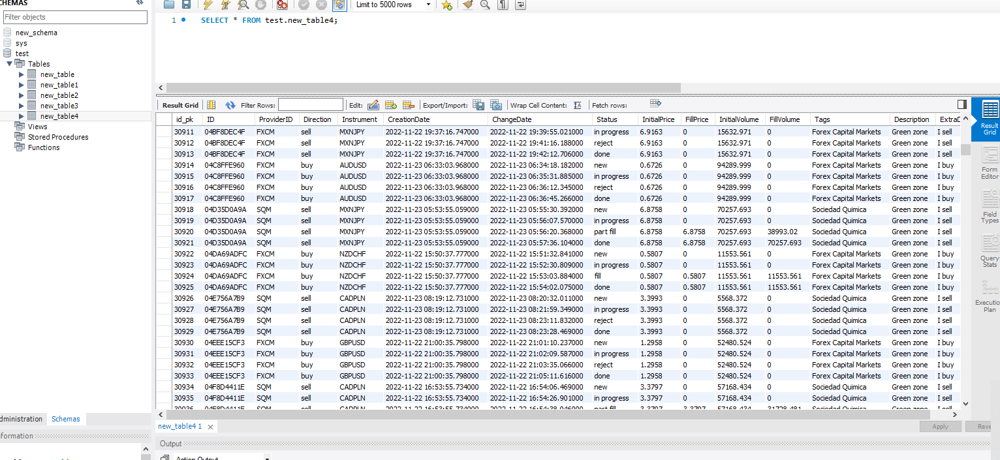

## *Generate 2500 thousand historical records in sql database using python*

___

### *Writing Code*

```python
from mysql.connector import MySQLConnection, Error
import logging
import os
import time
from configparser import ConfigParser
import math
import datetime
import sys
import new_variables as constants
from functools import reduce
import functools
import operator

def configure_logging():
    filename = os.path.join('/root/sql_task/', 'logger.log')
    logFormatter = logging.Formatter('%(asctime)s - %(name)s - %(levelname)s - %(module)s - %(message)s', datefmt = constants.LOGGER_FORMAT)
    Logger = logging.getLogger()
    Logger.setLevel(logging.INFO)
    # Create a logger to output to a .log file
    fileHandler = logging.FileHandler(filename.format(time.strftime('%Y%m%d%H%M%S')))
    fileHandler.setFormatter(logFormatter)
    Logger.addHandler(fileHandler)
    # Create a logger for output to the console
    consoleHandler = logging.StreamHandler()
    consoleHandler.setFormatter(logFormatter)
    Logger.addHandler(consoleHandler)
    Logger.info("Logger Completed!")
    return Logger

def formula_for_generation_pseudorandom(generate_pseudorandom_numbers_list, row, column, value, start_value_unix):
    if row == 0:
        return value['start_value'] + start_value_unix
    else:
        return (1/math.pi * math.acos(math.cos(((generate_pseudorandom_numbers_list[row-1][column]) * value['coefficient_for_high_dispersion']) \
                                    + 100))  * (value['upper_limit'] - value['bottom_limit1']) + value['bottom_limit2']) + start_value_unix

def linking_column_instrument_to_initial_price(generate_pseudorandom_numbers_list, row, column, value):
    temp_comparison_with_instrument_column = round(generate_pseudorandom_numbers_list[row][3])
    for fourth_level_index, value in value.items():
        if temp_comparison_with_instrument_column == fourth_level_index:
            generate_pseudorandom_numbers_list[row][column] = round(formula_for_generation_pseudorandom(generate_pseudorandom_numbers_list, row, column, value, 0), 3)
    return generate_pseudorandom_numbers_list[row][column]

def fix_pause_time_requirement(generate_pseudorandom_numbers_list, row, column, value):
    generate_pseudorandom_numbers_list[row][column] = round(formula_for_generation_pseudorandom(generate_pseudorandom_numbers_list, row, column, value, value['start_time_unix']), 3)
    if generate_pseudorandom_numbers_list[row][column]  > constants.START_BREAK and generate_pseudorandom_numbers_list[row][column]  < constants.END_BREAK:
        generate_pseudorandom_numbers_list[row][column] = round((constants.END_BREAK + generate_pseudorandom_numbers_list[row][4]), 3)   
    return generate_pseudorandom_numbers_list[row][column]

def conditionts_for_fill_price_and_volume(first_level_values, list_for_flatten_statuses, row, column, multiplier_value, key_status, all_list_pseudo_random_numbers):
    if list_for_flatten_statuses[row - 1] != first_level_values['special_status'] and key_status == list_for_flatten_statuses[row]: 
        all_list_pseudo_random_numbers[row][column] = round(all_list_pseudo_random_numbers[row][column - 1] * multiplier_value, 3)
    return all_list_pseudo_random_numbers[row][column]

def generate_all_pseudo_random_number():
    # Initialization of a two-dimensional array, deduce the required number of columns and rows from constants and fill with zeros.
    generate_pseudorandom_numbers_list = [[0 for x in range(constants.COLUMNS)] for x in range(constants.ROWS)] 
    # We get data to generate from the dictionary, the key of the first level of the dictionary matches column 2 of the dimensional array (from 0 to ...)
    dict = constants.FIND_PSEUDORANDOM_ROWS1
    for row in range(constants.ROWS):
        for column in range(constants.COLUMNS):
            for table_column_index, ranges_for_columns in dict.items():
                for range_as_key, value in ranges_for_columns.items():
                    if row in range_as_key:
                        if table_column_index == column:
                            # We get generated random numbers for all columns, only for the first row - unique, for the rest - sequentially from the first row
                            if table_column_index != 8 and table_column_index != 5:
                                generate_pseudorandom_numbers_list[row][column] = round(formula_for_generation_pseudorandom(generate_pseudorandom_numbers_list, row, column, value, 0), 3)
                            # Get "create date" given the break time from 23:00 - 24:00
                            # We check if the time generated by Unix falls into the break zone, then we add a random number in the range of 5 minutes to the end time of the break. 
                            elif table_column_index == 5:
                                generate_pseudorandom_numbers_list[row][column] = fix_pause_time_requirement(generate_pseudorandom_numbers_list, row, column, value)                                         
                            # We get the generated random numbers for the matching instrument from the 4th column
                            elif table_column_index == 8:   
                                generate_pseudorandom_numbers_list[row][column] = linking_column_instrument_to_initial_price(generate_pseudorandom_numbers_list, row, column, value)
    # We extract the seventh column with statuses to pass to the next function. We remove one fourth column from the array, as an auxiliary one, and return the list                                           
    getting_column_for_status_random = functools.reduce(operator.iconcat,[[j for i,j in enumerate(sub) if i == 7] for sub in generate_pseudorandom_numbers_list])
    return [[j for i,j in enumerate(sub) if i != 4] for sub in generate_pseudorandom_numbers_list], getting_column_for_status_random

def generate_status_all_zones(column_of_statuses_list):
    main_list_for_cases_red = []
    main_list_for_cases_green = []
    main_list_for_cases_blue = []
    # Depending on the ranges of zones, we compare the sequences generated earlier for these zones with arrays of possible variants of status subsets from the dictionary. We write them down in different lists.
    dict = constants.DICT_STATUS_GENERATE_ALL_ZONES
    names = [main_list_for_cases_red, main_list_for_cases_green, main_list_for_cases_blue]
    for count_of_names, value_of_names_list in enumerate(names):
        for index in range(len(column_of_statuses_list)):
            for count_of_ranges, ranges in dict.items():
                if count_of_names == count_of_ranges:  
                    for range_as_key, value_of_count_lists in ranges.items():
                        if index in range_as_key:    
                            names[count_of_names].append(dict[count_of_ranges][range_as_key][round(column_of_statuses_list[index])])
    # We remove one level of arrays, and write the statuses into a one-dimensional one sequentially, add to the general array "list_for_flatten_statuses", such an amount that we need for zones          
    list_for_flatten_statuses  = reduce(lambda x, y: x + y, main_list_for_cases_red )[0:constants.ROWS_FOR_RED_ZONE] + reduce(lambda x, y: x + y, main_list_for_cases_green)[0:constants.ROWS_FOR_GREEN_ZONE] \
    + reduce(lambda x, y: x + y, main_list_for_cases_blue)[0:constants.ROWS_FOR_BLUE_ZONE]

    return list_for_flatten_statuses
        
def get_data_from_pseudo_random_rows(all_list_pseudo_random_numbers, list_for_flatten_statuses):
    dict = constants.GET_VALUE_FROM_PSEUDORANDOM
    for column in range(constants.COLUMNS):
        for row in range(0, (constants.ROWS)-1):
            for table_column_index, first_level_values in dict.items():
                if table_column_index == column:
                    # First, we write the starting hex value in the first line. And then we make a dynamic random increment "temp" by which we multiply the previous row.
                    if column == 0:
                        if row == 0:
                            all_list_pseudo_random_numbers[row][column] = first_level_values['hex_start_number']
                        else:
                            temp = constants.INCREMENT_FOR_RANDOMNESS * all_list_pseudo_random_numbers [row][column]
                            all_list_pseudo_random_numbers[row][column] = ((hex(int(all_list_pseudo_random_numbers[row - 1][column], 16) + round(temp))).lstrip("0x").upper().zfill(10)) 
                    # We compare the key value from the string with the dictionary key and write the value to the array in columns 1..2..3
                    if column == 1 or column == 2:
                        all_list_pseudo_random_numbers[row][column] = dict[table_column_index][(round(float(all_list_pseudo_random_numbers[row][column])))]
                    # If the array "list_for_flatten_statuses" value corresponds to three statuses ('fill', 'done', 'part fill') in the dictionary, we get the initial price from column 7
                    if column == 8:
                        for key_status, bool_value in first_level_values.items():
                            all_list_pseudo_random_numbers[row][column] = conditionts_for_fill_price_and_volume(first_level_values, list_for_flatten_statuses, row, column, 1, key_status, all_list_pseudo_random_numbers)
                    # If the value in the list "list_for_flatten_statuses" corresponds to the values in dict, then we write the value from column 9 multiplied on "multiplier_value" into column 10, 
                    # if "reject" is in the previous line in list "list_for_flatten_statuses", then in "done" we leave empty                
                    if column == 10:
                        for key_status, multiplier_value in first_level_values.items():   
                            all_list_pseudo_random_numbers[row][column] = conditionts_for_fill_price_and_volume(first_level_values, list_for_flatten_statuses, row, column, multiplier_value, key_status, all_list_pseudo_random_numbers)
                    # We iterate over the second column, if the value matches the value in the dictionary, we write it in column 11
                    if column == 11:
                        all_list_pseudo_random_numbers[row][column] = dict[table_column_index][all_list_pseudo_random_numbers[row][column - 10]]
                    # If the line number falls within the range in the dictionary, we write the corresponding value in column 12
                    if column == 12:
                        for ranges, value in first_level_values.items():
                            if row in ranges:
                                all_list_pseudo_random_numbers[row][column] = dict[table_column_index][ranges]
                    # We iterate over the third column, if the value matches the value in the dictionary, we write it in column 13
                    if column == 13:
                        all_list_pseudo_random_numbers[row][column] = dict[table_column_index][all_list_pseudo_random_numbers[row][column - 11]]
            # We overwrite a separate column from list "list_for_flatten_statuses"  with statuses in the corresponding one in the general table
            if column == 6:
                    all_list_pseudo_random_numbers[row][column] = list_for_flatten_statuses[row]
            # Line by line, we check the values of the array "list_for_flatten_statuses" with statuses line by line, if, depending on the range, the value is not "True", we overwrite the next line of the array with the current one.       
            if column == [3, 7, 9]:
                for key_ranges, value in constants.IS_NEW_COLUMN_DICT.items():
                    if row in key_ranges:
                        if not value[list_for_flatten_statuses[row]]:
                            all_list_pseudo_random_numbers[row+1][column] = all_list_pseudo_random_numbers[row][column]
            if column == 3:
                all_list_pseudo_random_numbers[row][column] = dict[column][(round(all_list_pseudo_random_numbers[row][column]))]

    return  all_list_pseudo_random_numbers

def build_correct_table_based_on_statuses(updated_value_list_from_pseudo_random):
    # We iterate over the dictionary and the list checking the incoming status value
    updated_value_list_from_pseudo_random[0][5] = updated_value_list_from_pseudo_random[0][4] + updated_value_list_from_pseudo_random[0][5]
    for index in range(0,len(updated_value_list_from_pseudo_random)-1):
        for key_ranges, value in constants.IS_NEW_COLUMN_DICT.items():
            if index in key_ranges:
                # We collect tables depending on the statuses. Plus the Unix time + increment between columns 4 and 5. And before that, we do the correct sequence of increments in the 5th column when we form "current_row"
                if not value[updated_value_list_from_pseudo_random[index][6]]:
                    current_row = [updated_value_list_from_pseudo_random[index][0], updated_value_list_from_pseudo_random[index][1], updated_value_list_from_pseudo_random[index][2], updated_value_list_from_pseudo_random[index][3], updated_value_list_from_pseudo_random[index][4], \
                                  updated_value_list_from_pseudo_random[index][5] + updated_value_list_from_pseudo_random[index+1][5], updated_value_list_from_pseudo_random[index+1][6], updated_value_list_from_pseudo_random[index][7], updated_value_list_from_pseudo_random[index+1][8], updated_value_list_from_pseudo_random[index][9], \
                                  updated_value_list_from_pseudo_random[index+1][10], updated_value_list_from_pseudo_random[index][11], updated_value_list_from_pseudo_random[index][12], updated_value_list_from_pseudo_random[index][13]]
                    updated_value_list_from_pseudo_random[index+1] = current_row 
                # If not "done" we overwrite the next line (Unix time + increment change date)
                else:
                    updated_value_list_from_pseudo_random[index+1][5] = updated_value_list_from_pseudo_random[index+1][5] + updated_value_list_from_pseudo_random[index+1][4] 
                # Convert Unix to datatime. Return a datetime object with time zone information. Format the string datatime to human readable. Trim to 3 milliseconds and add a colon.
                for column in [4, 5]:
                    unix_convert_to_datatime = datetime.datetime.utcfromtimestamp(updated_value_list_from_pseudo_random[index][column]).astimezone()
                    formatted_time = (unix_convert_to_datatime.strftime(constants.FORMAT_FOR_DATATIME)[:23] + unix_convert_to_datatime.strftime(constants.FORMAT_FOR_DATATIME)[26:])
                    updated_value_list_from_pseudo_random[index][column] = formatted_time.replace('+0200', '+02:00')

    return  updated_value_list_from_pseudo_random

def read_db_config(filename = constants.PATH_CONFIG_FILE, section='mysql'):
    # Create a parser and read the ini config file
    parser = ConfigParser()
    parser.read(filename)
    # Read file line by line and add to dictionary
    db = {}
    if parser.has_section(section):
        items = parser.items(section)
        for item in items:
            db[item[0]] = item[1]
    else:
        raise Exception('{0} not found in the {1} file'.format(section, filename))

    return db

def connect(set_up_logger):
    # Pass in the form of a dictionary our data to connect to the database
    db_config = read_db_config()
    connection = None
    try:
        print('Connecting to MySQL database...')
        connection = MySQLConnection(**db_config)
        # Establish a connection to the base, with the appropriate pin to pass to the next function
        if connection.is_connected():
            db_Info = connection.get_server_info()
            set_up_logger.info("Connected to MySQL Server version %s" % db_Info)
            cursor = connection.cursor()
            cursor.execute("select database();")
            record = cursor.fetchone()
            set_up_logger.info("You're connected to database: %s" % record)
        else:
            set_up_logger.critical("MySQL connection is closed")  

    except Error as error:
        set_up_logger.info("Error while connecting to MySQL %s" % error)
        sys.exit(1)

    return connection

def drop_and_create_table (connection, build_correct_table_values, set_up_logger):
    # We iterate over the array, turn our strings into delimited tuples, and the following method will do a multiple concatenation of our qwery + string tuples
    try:
        sql_query_string_for_insert = str(tuple(build_correct_table_values[0]))
        for index in range (1, constants.ROWS-1):
            sql_query_string_for_insert += ', ' + str(tuple(build_correct_table_values[index]))
        formatted_sql_query = constants.INSERT_QUERY + sql_query_string_for_insert     
        connection._execute_query(formatted_sql_query)
        connection.commit()
        
    except Error:
        set_up_logger.critical('Connection failed.')
    # Check if the connection to the database is open, if yes - close.              
    finally:
        if connection.is_connected():
            connection.close()
            set_up_logger.info("MySQL connection is closed")     

def main():
    set_up_logger = configure_logging() 
    generate_all_pseudo_random_numbers_list = generate_all_pseudo_random_number()
    all_list_pseudo_random_numbers = generate_all_pseudo_random_numbers_list[0]
    column_of_statuses_list = generate_all_pseudo_random_numbers_list[1]
    get_all_zones_from_numbers = generate_status_all_zones(column_of_statuses_list)
    updated_value_list_from_pseudo_random = get_data_from_pseudo_random_rows(all_list_pseudo_random_numbers, get_all_zones_from_numbers)
    build_correct_table_values = build_correct_table_based_on_statuses(updated_value_list_from_pseudo_random)
    db_connection_to_mysql = read_db_config()
    connect_to_database = connect(set_up_logger)
    set_and_execute_mysql_query = drop_and_create_table (connect_to_database, build_correct_table_values, set_up_logger)
main()

```


____

### *Constants*


```python


ROWS_FOR_RED_ZONE = 376
ROWS_FOR_GREEN_ZONE = 1372
ROWS_FOR_BLUE_ZONE = 754
START_VALUE_GENERATION_ID = hex(4374977048)
INCREMENT_FOR_RANDOMNESS = 92832629
START_BREAK = 1669158000
END_BREAK = 1669161600
FORMAT_FOR_DATATIME = '%Y-%m-%d %H:%M:%S.%f%z'
ROWS = 2501
COLUMNS = 15
PATH_CONFIG_FILE = 'config.ini'
INSERT_QUERY = "INSERT INTO test.new_table4 (ID, ProviderID, Direction, Instrument, CreationDate, ChangeDate, Status, InitialPrice, \
                                FillPrice, InitialVolume, FillVolume, Tags, Description, ExtraData) values "
LOGGER_FORMAT = '%Y-%m-%d %H:%M:%S'


# 1/math.pi*math.acos(math.cos(start_value+100))*((upper_limit-bottom_limit1)+bottom_limit2) The first line is generated by this formula. We get a random number in the range.
# 1/math.pi*math.acos(math.cos(start_value * coefficient_for_high_dispersion))*((upper_limit-bottom_limit1)+bottom_limit2) All the following lines are generated by binding the "start_value"
# to the previously generated values of the previous line, providing pseudo randomness.

# Substitution numbers for the formula for generating a pseudo-random series of random numbers for the column "hex id"
FIND_PSEUDORANDOM_ROWS1 = {0 : {range(0, 1)         : {'start_value' : 0.557},                                
                                range(1, 2501)      : {'upper_limit' : 1,      'bottom_limit1' : 0.1, 'bottom_limit2' : 0.1, 'coefficient_for_high_dispersion' : 666666}
                                },
# Substitution numbers for the formula for generating a pseudo-random series of random numbers for the column "provider name"
                           1 : {range(0, 1)         : {'start_value' : 0.337},                                
                                range(1, 2501)      : {'upper_limit' : 1,      'bottom_limit1' : 0.1, 'bottom_limit2' : 0.1, 'coefficient_for_high_dispersion' : 555555}
                                },
# Substitution numbers for the formula for generating a pseudo-random series of random numbers for the column "direction name"
                           2 : {range(0, 1)         : {'start_value' : 0.458},                                
                                range(1, 2501)      : {'upper_limit' : 1,      'bottom_limit1' : 0.1,  'bottom_limit2' : 0.1, 'coefficient_for_high_dispersion' : 444444}
                                },
# Substitution numbers for the formula for generating a pseudo-random series of random numbers for the column "instrument name"
                           3 : {range(0, 1)         : {'start_value' : 7.437},                               
                                range(1, 2501)      : {'upper_limit' : 10,     'bottom_limit1' : 0.1,  'bottom_limit2' : 0.1, 'coefficient_for_high_dispersion' : 555555}
                                },
# Substitution numbers for the formula for generating a pseudo-random series of random numbers for the additional column for add to "create_date" + "time_after_break", 23:00-24:00
                           4 : {range(0, 1)         : {'start_value' : 278.987},                                                                                         
                                range(1, 2501)      : {'upper_limit' : 300,    'bottom_limit1' : 1,    'bottom_limit2' : 1,   'coefficient_for_high_dispersion' : 333333}
                                },
# Substitution numbers for the formula for generating a pseudo-random series of random numbers for the column "create date", 1-376 (Redzone 11:00 - 12:00); 376-1749 (Greenzone 12:00 - 11:00); 1749-2500 (Bluezone 11:00 - 12:00)
                           5 : {range(0, 1)         : {'start_value' : 2567.456,                                                                                          'start_time_unix' : 1669118400},                                                                                                                                                                                          
                                range(1, 376)       : {'upper_limit' : 3300,   'bottom_limit1' : 1,    'bottom_limit2' : 1,   'coefficient_for_high_dispersion' : 777777, 'start_time_unix' : 1669118400},
                                range(376, 1749)    : {'upper_limit' : 78900,  'bottom_limit1' : 1,    'bottom_limit2' : 1,   'coefficient_for_high_dispersion' : 717171, 'start_time_unix' : 1669122000},
                                range(1749, 2501)   : {'upper_limit' : 3300,   'bottom_limit1' : 1,    'bottom_limit2' : 1,   'coefficient_for_high_dispersion' : 707070, 'start_time_unix' : 1669201200} 
                                },
# Substitution numbers for the formula for generating a pseudo-random series of random numbers for the "column_for_increment_to createdate/column changedate"
                           6 : {range(0, 1)         : {'start_value' : 3.567},                                  
                                range(1, 2500)      : {'upper_limit' : 100,    'bottom_limit1' : 10,   'bottom_limit2' : 10,  'coefficient_for_high_dispersion' : 777777}
                                }, 
# Substitution numbers for the formula for generating a pseudo-random series of random numbers for the column "status", 1-376 (redzone without "new"), 376-1749 (greenzone), 1749-2501 (bluezone without "done")
                           7 : {range(0, 1)         : {'start_value' : 4.567},                                 
                                range(1, 376)       : {'upper_limit' : 6,      'bottom_limit1' : 0.01, 'bottom_limit2' : 0.01, 'coefficient_for_high_dispersion' : 177777},      
                                range(376, 1749)    : {'upper_limit' : 2,      'bottom_limit1' : 0.01, 'bottom_limit2' : 0.01, 'coefficient_for_high_dispersion' : 277777},   
                                range(1749, 2501)   : {'upper_limit' : 2,      'bottom_limit1' : 0.01, 'bottom_limit2' : 0.01, 'coefficient_for_high_dispersion' : 377777}   
                                },
# Substitution numbers for the formula for generating a pseudo-random series of random numbers for the column "initial price". Linking with column "instrument".                                                                                                                                                                          
                           8 : {range(0, 1)    : {0 : {'start_value' : 136.589}, # USDJPY     
                                                  1 : {'start_value' : 1.267}, # GBPUSD     
                                                  2 : {'start_value' : 0.967}, # USDCHF
                                                  3 : {'start_value' : 0.711}, # AUDUSD
                                                  4 : {'start_value' : 1.113}, # EURUSD
                                                  5 : {'start_value' : 3.456}, # CADPLN
                                                  6 : {'start_value' : 82.123}, # NZDJPY
                                                  7 : {'start_value' : 1.745}, # GBPCAD
                                                  8 : {'start_value' : 0.578}, # NZDCHF
                                                  9 : {'start_value' : 6.890}, # MXNJPY
                                                 10 : {'start_value' : 1.051}},# EURCHF

                                                                                                                                                                       
                               range(1, 2500) :  {0 : {'upper_limit' : 140,   'bottom_limit1' : 130.95, 'bottom_limit2' : 130.95, 'coefficient_for_high_dispersion' : 666666}, # USDJPY
                                                  1 : {'upper_limit' : 1.30,  'bottom_limit1' : 1.12,   'bottom_limit2' : 1.12,   'coefficient_for_high_dispersion' : 666666}, # GBPUSD
                                                  2 : {'upper_limit' : 0.99,  'bottom_limit1' : 0.9,    'bottom_limit2' : 0.9,    'coefficient_for_high_dispersion' : 666666}, # USDCH
                                                  3 : {'upper_limit' : 0.720, 'bottom_limit1' : 0.670,  'bottom_limit2' : 0.670,  'coefficient_for_high_dispersion' : 666666}, # AUDUSD
                                                  4 : {'upper_limit' : 1.2,   'bottom_limit1' : 1.03,   'bottom_limit2' : 1.03,   'coefficient_for_high_dispersion' : 666666}, # EURUSD
                                                  5 : {'upper_limit' : 3.7,   'bottom_limit1' : 3.2323, 'bottom_limit2' : 3.2323, 'coefficient_for_high_dispersion' : 666666}, # CADPLN
                                                  6 : {'upper_limit' : 88,    'bottom_limit1' : 80.65,  'bottom_limit2' : 80.65,  'coefficient_for_high_dispersion' : 666666}, # NZDJPY
                                                  7 : {'upper_limit' : 1.810, 'bottom_limit1' : 1.60,   'bottom_limit2' : 1.60,   'coefficient_for_high_dispersion' : 666666}, # GBPCAD
                                                  8 : {'upper_limit' : 0.65,  'bottom_limit1' : 0.55,   'bottom_limit2' : 0.55,   'coefficient_for_high_dispersion' : 666666}, # NZDCHF
                                                  9 : {'upper_limit' : 7.11,  'bottom_limit1' : 6.75,   'bottom_limit2' : 6.75,   'coefficient_for_high_dispersion' : 666666}, # MXNJPY
                                                 10 : {'upper_limit' : 1.09,  'bottom_limit1' : 0.946,  'bottom_limit2' : 0.946,  'coefficient_for_high_dispersion' : 666666}  # EURCHF
                              }},
# Substitution numbers for the formula for generating a pseudo-random series of random numbers for the column "initial volume" in range 1 - 100000$
                         10  : {range(0, 1)    :      {'start_value' : 45678.456},                                          
                                range(1, 2500) :      {'upper_limit' : 100000, 'bottom_limit1': 1,      'bottom_limit2' : 1,      'coefficient_for_high_dispersion' : 777777}
                              }}
                                                  
# In "get_data_from_pseudo_random_rows" check the sequence against the dictionary key, get data for column "hexid (column 0)"
GET_VALUE_FROM_PSEUDORANDOM = {0 : {'hex_start_number' : str(hex(4374977048).lstrip("0x").upper().zfill(10))},
# In "get_data_from_pseudo_random_rows" check the sequence against the dictionary key, get data for column "provider (column 1)"                                
                               1 : {0 : 'FXCM', 1 : 'SQM'}, 
# In "get_data_from_pseudo_random_rows" check the sequence against the dictionary key, get data for column "direction (column 2)"                              
                               2 : {0 : 'sell', 1 : 'buy'}, 
# Get data for column "instrument(column 3)"                               
                               3 : {0 : 'USDJPY', 1 : 'GBPUSD', 2 : 'USDCHF', 3 : 'AUDUSD', 4 : 'EURUSD', 5 : 'CADPLN', 6 : 'NZDJPY', 7 : 'GBPCAD', 8 : 'NZDCHF', 9 : 'MXNJPY', 10 : 'EURCHF'}, 
# In "get_data_from_pseudo_random_rows" check the sequence against the dictionary key, get data for column "fill price (column 8)"                              
                               8 : {'done' : True, 'part fill' : True, 'fill' : True, 'special_status' : 'reject'}, 
# In "get_data_from_pseudo_random_rows" check the sequence against the dictionary key, get data for column "fill volume (column 10)"                              
                              10 : {'part fill' : 0.555, 'fill' : 1, 'done' : 1, 'special_status' : 'reject'}, 
# In "get_data_from_pseudo_random_rows" check the sequence against the dictionary key, get data for column "Tags (column 11)"                             
                              11 : {'FXCM' : 'Forex Capital Markets', 'SQM' : 'Sociedad Quimica'}, 
# In "get_data_from_pseudo_random_rows" check the sequence against the dictionary key, get data for column "Description (column 12)"                             
                              12 : {range(0, 376) : 'Red zone', range(376, 1749) : 'Green zone', range(1749, 2501) : 'Blue zone'}, 
# In "get_data_from_pseudo_random_rows" check the sequence against the dictionary key, get data for column "Tags (column 13)"                             
                              13 : {'sell' : 'I sell', 'buy' : 'I buy'}} 

# In "generate_status_all_zones". Get subsets of all possible status options for column "status (column 6) RED ZONE"
DICT_STATUS_GENERATE_ALL_ZONES =  {0 : {range(0, 376) :    {0 : ['done'],  
                                                            1 : ['reject', 'done'],
                                                            2 : ['part fill', 'done'],
                                                            3 : ['fill', 'done'],
                                                            4 : ['in progress', 'reject', 'done'],
                                                            5 : ['in progress', 'part fill', 'done'],
                                                            6 : ['in progress', 'fill', 'done']}},
# In "generate_status_all_zones". Get subsets of all possible status options for column "status (column 6) GREEN ZONE"
                                   1 : {range(376, 1749) : {0 : ['new', 'in progress', 'reject', 'done'], 
                                                            1 : ['new', 'in progress', 'part fill', 'done'],
                                                            2 : ['new', 'in progress', 'fill', 'done']}},
                                                    
# In "generate_status_all_zones". Get subsets of all possible status options for column "status (column 6) BLUE ZONE"  
                                   2 : {range(1749, 2501) : {0 : ['new', 'in progress', 'reject'], 
                                                             1 : ['new', 'in progress', 'part fill'],
                                                             2 : ['new', 'in progress', 'fill']}}}

# Used in a function "build_correct_table_based_on_statuses" to form "current_row"                                                        
IS_NEW_COLUMN_DICT = {           
     range(0, 376):{"in progress": False, "fill": False, "part fill": False, "reject": False, "done": True}, 
     range(376, 1749):{"new": False, "in progress": False, "fill": False, "part fill": False, "reject": False, "done": True},
     range(1749, 2501):{"new": False, "in progress": False, "fill": True, "part fill": True, "reject": True}
     }

```

____

### *Config*


``` python
[mysql]
host = localhost
database = test
user = root
password = пароль
```
____

### *Output*

``` bash
root@debian ~/sql_task $ python3 /root/sql_task/sql_task.py
2023-02-15 11:27:37 - root - INFO - sql_task - Logger Completed!
Connecting to MySQL database...
2023-02-15 11:27:37 - mysql.connector.authentication - INFO - authentication - package: mysql.connector.plugins
2023-02-15 11:27:37 - mysql.connector.authentication - INFO - authentication - plugin_name: caching_sha2_password
2023-02-15 11:27:37 - mysql.connector.authentication - INFO - authentication - AUTHENTICATION_PLUGIN_CLASS: MySQLCachingSHA2PasswordAuthPlugin
2023-02-15 11:27:37 - root - INFO - sql_task - Connected to MySQL Server version 8.0.31
2023-02-15 11:27:37 - root - INFO - sql_task - You're connected to database: test
2023-02-15 11:27:37 - root - INFO - sql_task - LINES for Red zone - 376, for Green zone - 1372, Blue zone - 754, successfully written to the database and saved!
2023-02-15 11:27:37 - root - INFO - sql_task - MySQL connection is closed
```

____

### *Output in mysql*




____

### *Links*

1. https://www.sqlitetutorial.net/sqlite-python/creating-tables/
2. https://overiq.com/mysql-connector-python-101/creating-tables-using-connector-python/
3. https://www3.ntu.edu.sg/home/ehchua/programming/webprogramming/Python2_Apps.html
4. https://pynative.com/python-mysql-database-connection/
5. https://realpython.com/python-mysql/