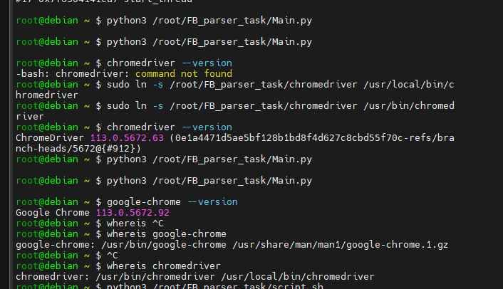
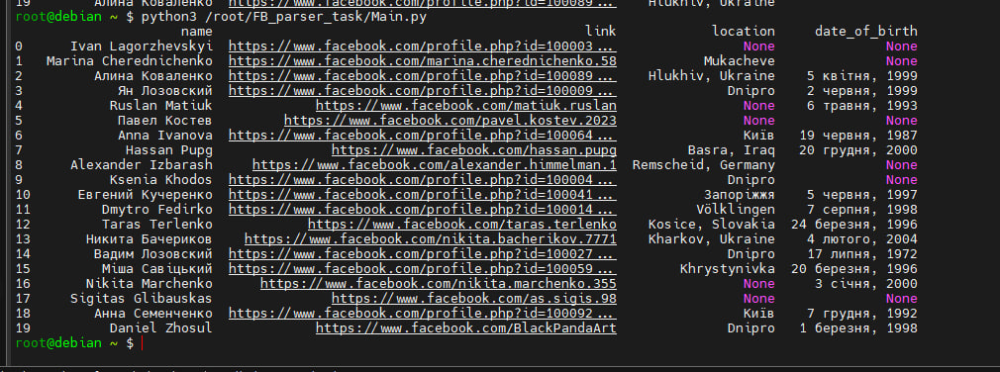

## *Parsing frends from Facebook*

___

### *Pre-install*

+ *Установить гугл хром на линукс дебиан 11 можно по пользуясь иструкцией по [ссылке](https://infoit.com.ua/linux/debian/kak-ustanovit-google-chrome-na-debian-11/)*

+ *Дальше нужно скачать в папку с проектом вебдрайвер гугл хроме точно такой же версии что и браузер по [ссылке](https://gist.github.com/siumhossain/1aa24622d8fda5053581c87ca6457638)*

+ *Дальше установить селениум на машину*

```python
pip3 install selenium
```
+ *Сделать линк на бинарник хрома в папку /usr/bin/ и проверить*



+ *Не забыть передать опцию `('--no-sandbox')` в коде иначе драйвер не будет работать.*

+ *Результат парсера. Перед каждым запуском проверить локаторы `xpath` в `DOM` иначе доступ к нужным элементам может изменится и программа не заработает. Парсер будет ходить по списку друзей рандомно, на такое количество которое задается в конфигфайле в  `total_friends` получаю инфу, есть ли на профиле фотка или нет, если нет - вывожу в лог, а также имя_фамилия, ссылку на профиль, локация, и число, месяц и год рождения, если только число указано или только год в профиле, заполняю `None`, все это попадает через словарь в кадр данных `pandas`*




___

### *links*

+ *[Ютуб1](https://www.youtube.com/watch?v=KQiDLVa9sX4&t=516s)*
  
+ *[Ютуб2](https://www.youtube.com/watch?v=EVGH_XxAbXQ)*
  
+ *[Ютуб3](https://www.youtube.com/watch?v=NhG__BL8zFo&t=524s)*

+ *[Пример парсера](https://github.com/deeppbluesky/facebook-friends/blob/master/facebook-friends.py)*

+ *[Ожидание](https://selenium-python.readthedocs.io/waits.html)*

+ *[Клик](https://sqa.stackexchange.com/questions/51149/how-to-click-on-the-list-when-it-said-the-list-has-no-attribute-click)*

+ *[Если селениуму не будет хватать памяти при прокрутке большого списка](https://stackoverflow.com/questions/73199830/web-scraping-social-media-followers-but-the-list-in-the-100s-of-thousands-sele)*

+ *[Error Handling in Selenium on Python](https://www.pingshiuanchua.com/blog/post/error-handling-in-selenium-on-python)*

+ *[Error Handling](https://www.programcreek.com/python/example/85671/selenium.common.exceptions.NoSuchElementException)*

+ *[collections - defauldict](https://www.youtube.com/watch?v=i-AG7WKGYww)*

+ *[xpath](https://onedev.net/post/458)*